# Wattenberger Kumiko for QGIS

This repository contains the Kumiko patterns as SVGs that are ready to be used in QGIS as SVG Fill.

## Inspiration

This style package is inspired by Wattenberger's [Kumiko generator](https://kumiko-generator.netlify.app/). To view the source code, please go to this [GitHub](https://github.com/Wattenberger/kumiko) repository. I believe she was inspired by this [video](https://www.youtube.com/watch?v=-NuqwJz9RNE&ab_channel=%E7%AB%B9%E4%B8%AD%E5%A4%A7%E5%B7%A5%E9%81%93%E5%85%B7%E9%A4%A8).

The original Kumikos can be found in the [*kumiko*](https://github.com/clronniema/qgis-kumiko-svg/tree/master/kumiko) directory. Click on the images below to directly go to the raw content. More information at the bottom on applying these styles to QGIS.

<a href="https://raw.githubusercontent.com/clronniema/qgis-kumiko-svg/master/qgis-kumiko/a.svg">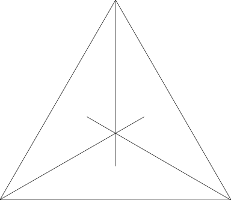</a>
<a href="https://raw.githubusercontent.com/clronniema/qgis-kumiko-svg/master/qgis-kumiko/asa-no-ha1.svg">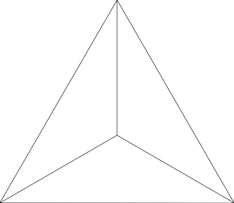</a>
<a href="https://raw.githubusercontent.com/clronniema/qgis-kumiko-svg/master/qgis-kumiko/asa-no-ha2.svg">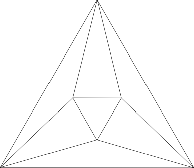</a>
<a href="https://raw.githubusercontent.com/clronniema/qgis-kumiko-svg/master/qgis-kumiko/asa-no-ha3.svg">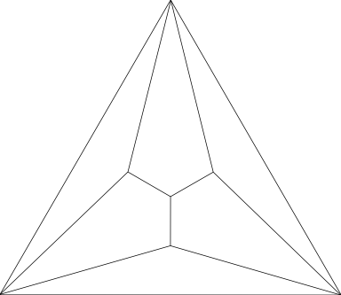</a>
<a href="https://raw.githubusercontent.com/clronniema/qgis-kumiko-svg/master/qgis-kumiko/asa-no-ha4.svg">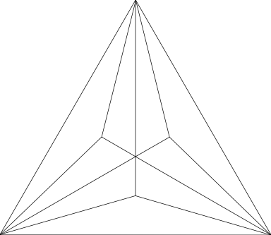</a>
<a href="https://raw.githubusercontent.com/clronniema/qgis-kumiko-svg/master/qgis-kumiko/asa-no-ha5.svg">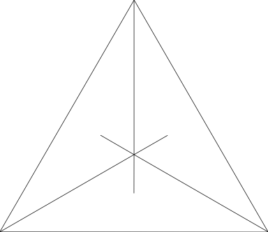</a>
<a href="https://raw.githubusercontent.com/clronniema/qgis-kumiko-svg/master/qgis-kumiko/b.svg">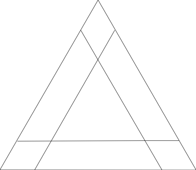</a>
<a href="https://raw.githubusercontent.com/clronniema/qgis-kumiko-svg/master/qgis-kumiko/c.svg">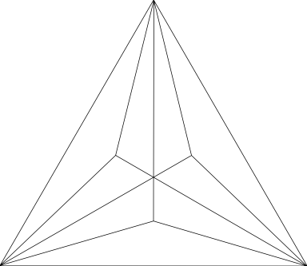</a>
<a href="https://raw.githubusercontent.com/clronniema/qgis-kumiko-svg/master/qgis-kumiko/d.svg">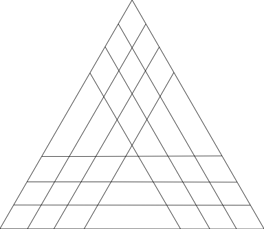</a>
<a href="https://raw.githubusercontent.com/clronniema/qgis-kumiko-svg/master/qgis-kumiko/e.svg">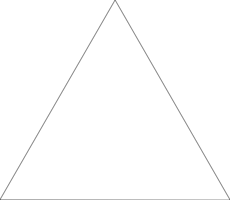</a>
<a href="https://raw.githubusercontent.com/clronniema/qgis-kumiko-svg/master/qgis-kumiko/f.svg">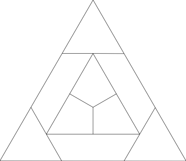</a>
<a href="https://raw.githubusercontent.com/clronniema/qgis-kumiko-svg/master/qgis-kumiko/g.svg">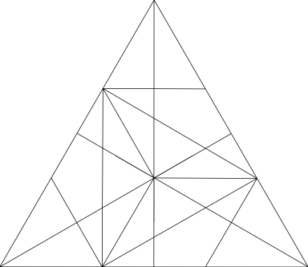</a>
<a href="https://raw.githubusercontent.com/clronniema/qgis-kumiko-svg/master/qgis-kumiko/h.svg">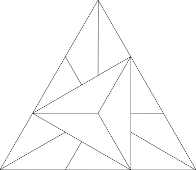</a>
<a href="https://raw.githubusercontent.com/clronniema/qgis-kumiko-svg/master/qgis-kumiko/i.svg">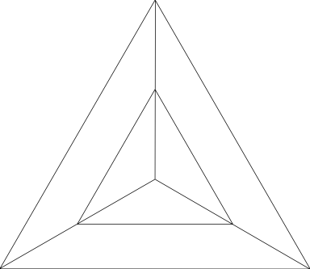</a>
<a href="https://raw.githubusercontent.com/clronniema/qgis-kumiko-svg/master/qgis-kumiko/j.svg">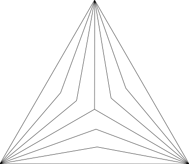</a>
<a href="https://raw.githubusercontent.com/clronniema/qgis-kumiko-svg/master/qgis-kumiko/kuruma1.svg">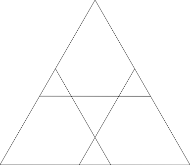</a>
<a href="https://raw.githubusercontent.com/clronniema/qgis-kumiko-svg/master/qgis-kumiko/kuruma2.svg">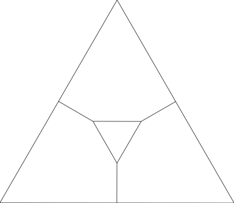</a>
<a href="https://raw.githubusercontent.com/clronniema/qgis-kumiko-svg/master/qgis-kumiko/kuruma3.svg">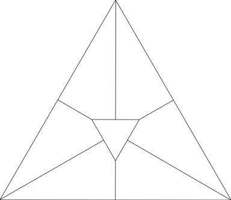</a>
<a href="https://raw.githubusercontent.com/clronniema/qgis-kumiko-svg/master/qgis-kumiko/l.svg">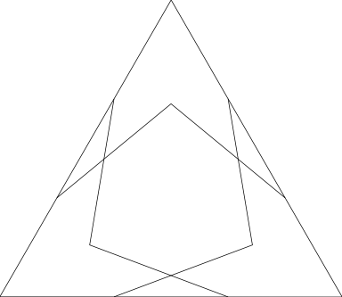</a>
<a href="https://raw.githubusercontent.com/clronniema/qgis-kumiko-svg/master/qgis-kumiko/m.svg">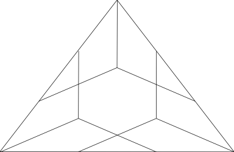</a>
<a href="https://raw.githubusercontent.com/clronniema/qgis-kumiko-svg/master/qgis-kumiko/misc1.svg">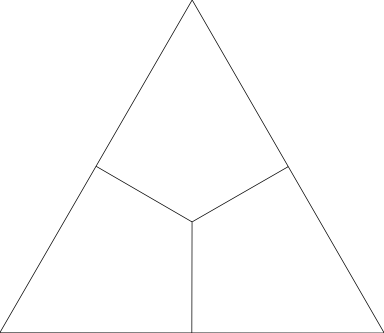</a>
<a href="https://raw.githubusercontent.com/clronniema/qgis-kumiko-svg/master/qgis-kumiko/misc2.svg">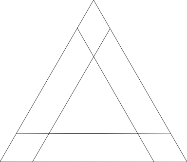</a>
<a href="https://raw.githubusercontent.com/clronniema/qgis-kumiko-svg/master/qgis-kumiko/misc3.svg">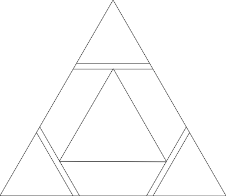</a>
<a href="https://raw.githubusercontent.com/clronniema/qgis-kumiko-svg/master/qgis-kumiko/misc4.svg">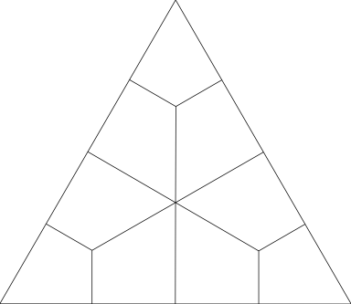</a>
<a href="https://raw.githubusercontent.com/clronniema/qgis-kumiko-svg/master/qgis-kumiko/misc5.svg">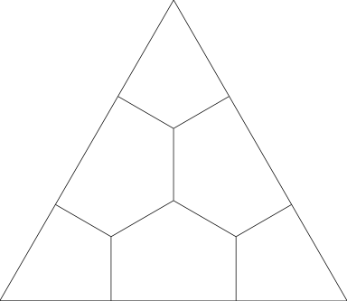</a>
<a href="https://raw.githubusercontent.com/clronniema/qgis-kumiko-svg/master/qgis-kumiko/misc6.svg">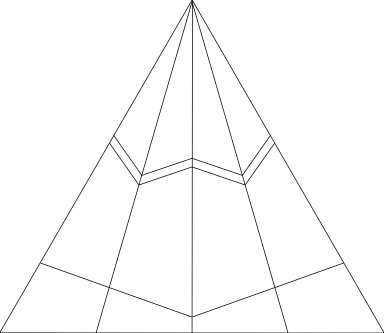</a>
<a href="https://raw.githubusercontent.com/clronniema/qgis-kumiko-svg/master/qgis-kumiko/misc7.svg">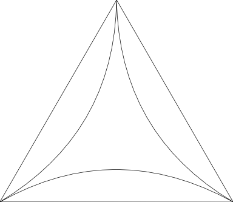</a>
<a href="https://raw.githubusercontent.com/clronniema/qgis-kumiko-svg/master/qgis-kumiko/n.svg">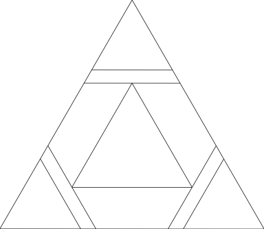</a>
<a href="https://raw.githubusercontent.com/clronniema/qgis-kumiko-svg/master/qgis-kumiko/o.svg">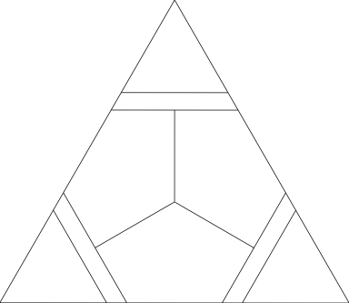</a>
<a href="https://raw.githubusercontent.com/clronniema/qgis-kumiko-svg/master/qgis-kumiko/p.svg">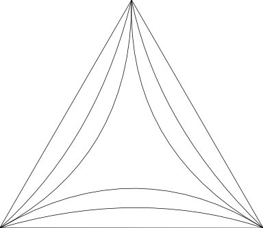</a>
<a href="https://raw.githubusercontent.com/clronniema/qgis-kumiko-svg/master/qgis-kumiko/q.svg">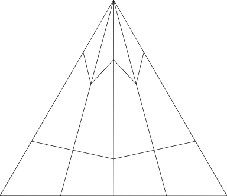</a>
<a href="https://raw.githubusercontent.com/clronniema/qgis-kumiko-svg/master/qgis-kumiko/r.svg">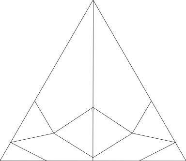</a>
<a href="https://raw.githubusercontent.com/clronniema/qgis-kumiko-svg/master/qgis-kumiko/rindo1.svg">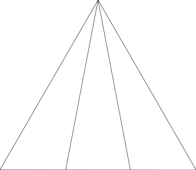</a>
<a href="https://raw.githubusercontent.com/clronniema/qgis-kumiko-svg/master/qgis-kumiko/rindo2.svg">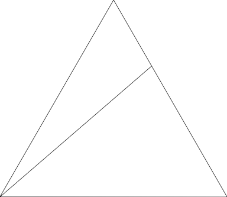</a>
<a href="https://raw.githubusercontent.com/clronniema/qgis-kumiko-svg/master/qgis-kumiko/rindo3.svg">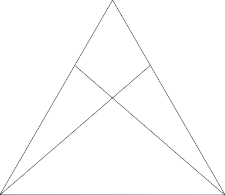</a>
<a href="https://raw.githubusercontent.com/clronniema/qgis-kumiko-svg/master/qgis-kumiko/s.svg">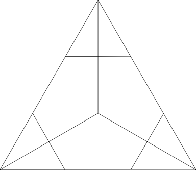</a>
<a href="https://raw.githubusercontent.com/clronniema/qgis-kumiko-svg/master/qgis-kumiko/sakura1.svg">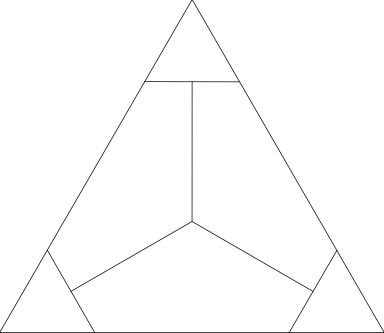</a>
<a href="https://raw.githubusercontent.com/clronniema/qgis-kumiko-svg/master/qgis-kumiko/sakura1b.svg">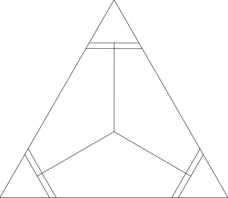</a>
<a href="https://raw.githubusercontent.com/clronniema/qgis-kumiko-svg/master/qgis-kumiko/sakura2.svg">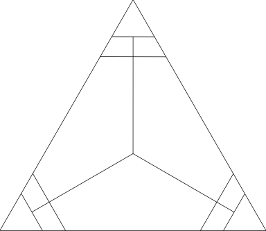</a>
<a href="https://raw.githubusercontent.com/clronniema/qgis-kumiko-svg/master/qgis-kumiko/sakura3.svg">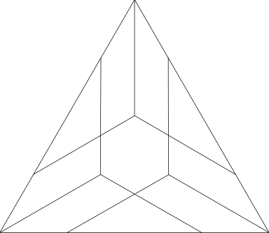</a>
<a href="https://raw.githubusercontent.com/clronniema/qgis-kumiko-svg/master/qgis-kumiko/sakura4.svg">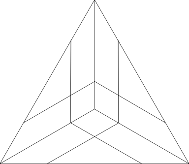</a>
<a href="https://raw.githubusercontent.com/clronniema/qgis-kumiko-svg/master/qgis-kumiko/t.svg">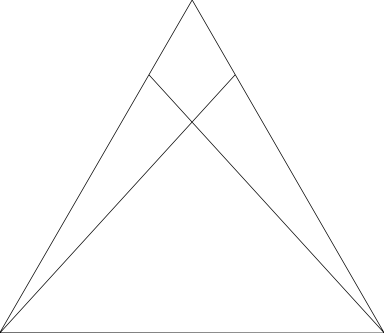</a>
<a href="https://raw.githubusercontent.com/clronniema/qgis-kumiko-svg/master/qgis-kumiko/u.svg">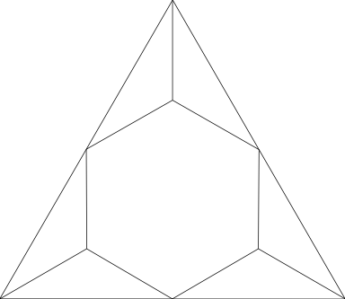</a>
<a href="https://raw.githubusercontent.com/clronniema/qgis-kumiko-svg/master/qgis-kumiko/v.svg">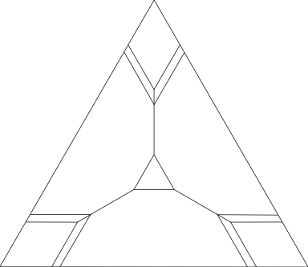</a>
<a href="https://raw.githubusercontent.com/clronniema/qgis-kumiko-svg/master/qgis-kumiko/w.svg">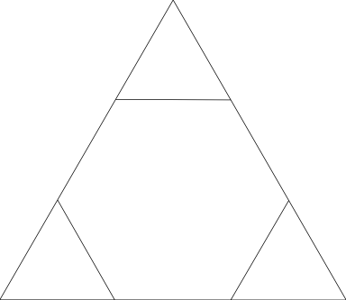</a>
<a href="https://raw.githubusercontent.com/clronniema/qgis-kumiko-svg/master/qgis-kumiko/x.svg">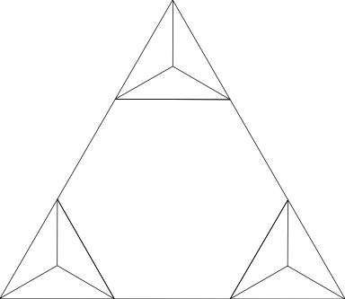</a>
<a href="https://raw.githubusercontent.com/clronniema/qgis-kumiko-svg/master/qgis-kumiko/y.svg">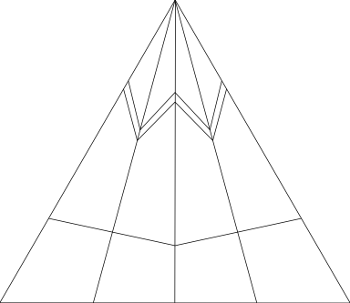</a>

## Examples

Here are some rough examples of what you can do:

#### [**Uniform Kumiko Applied over Municipalities of Finland**](https://github.com/clronniema/qgis-kumiko-svg/blob/master/example/finland_kumiko.qml)
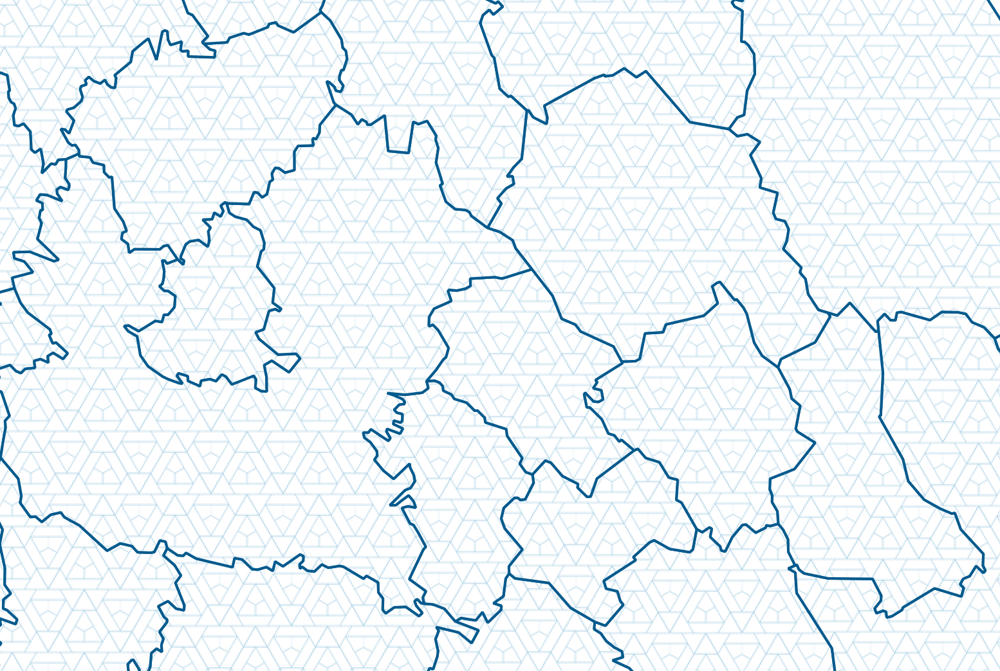
#### [**World Population Kumiko by Population Rank**](https://github.com/clronniema/qgis-kumiko-svg/blob/master/example/countries_pop_kumiko.qml)
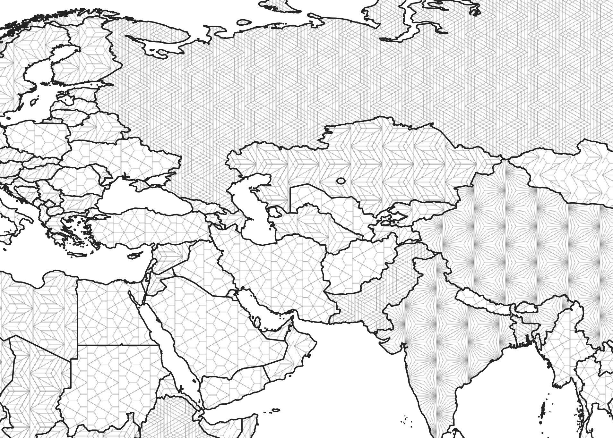
#### **Varying Rotation Kumiko Pattern of Africa**
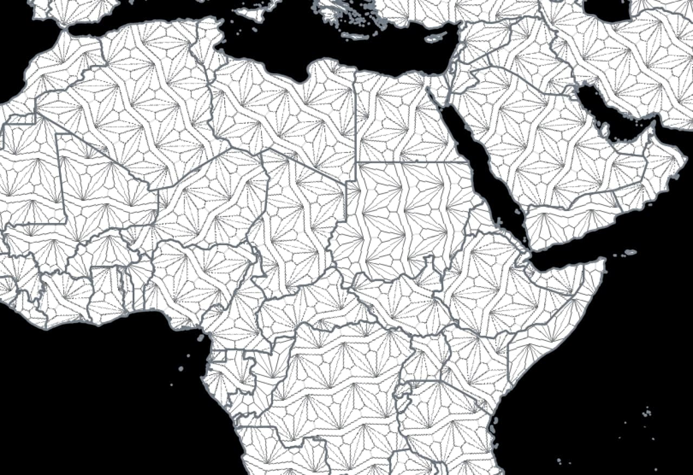
#### **Kumiko Country GIF**

## Changes I Have Made to the Wattenberger SVGs

The SVGs from Wattenberger are not directly usable for QGIS. The original images compose of a single tile of isocelese triangle, without filling up the whole SVG canvas. Therefore, I used the Python script *kumiko_to_square.py* to automatically complete the tessellation. 

Also, the fill settings are adjusted according to the [QGIS documentation](https://docs.qgis.org/3.16/en/docs/user_manual/style_library/symbol_selector.html#svg-marker). They are:

- fill=param(fill)
- stroke=param(outline)
- stroke-width=param(outline-width)

These attributes will allow QGIS to take control of the colors, and lines of the SVG polygon fills. A default value is also given, for viewing in the QGIS SVG browser panel.

## Applying the SVGs

You may find sample style files (.xml) in the [*example*](https://github.com/clronniema/qgis-kumiko-svg/blob/master/example/) folder and try out the styles. The styles are being reviewed in QGIS Style, hopefully they will be approved soon. Refer to this section of the [Importing Items](https://docs.qgis.org/3.16/en/docs/user_manual/style_library/style_manager.html#importing-items) section of documentation on importing styles.

Another way is to download the SVGs from this repository and register a folder for QGIS to search for SVGs. To do so, refer to this section of the [System Settings](https://docs.qgis.org/3.16/en/docs/user_manual/introduction/qgis_configuration.html#svg-paths) section of the documentation.

You may also scroll up in this readme and click the thumbnails of kumikos. Copy the link (i.e. *https://raw.githubusercontent.com/clronniema/qgis-kumiko-svg/master/qgis-kumiko/f.svg*), use this link as your link to SVG. 

Feel free to experiment with the **rotation** field as well, you may be surprised with the result!

## Credits

- [@Wattenberger](https://github.com/Wattenberger) - for creating and sharing the awesome SVGs
- [@tjukanovt](https://github.com/tjukanovt) - awesome lecture during the ISSonVIS 2021 and advising 
